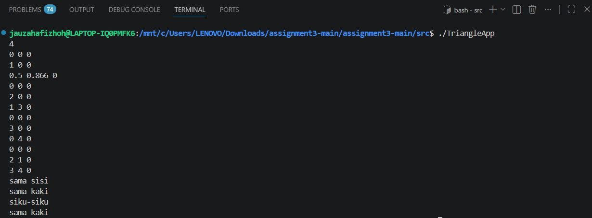

# Laporan Programming Assignment 3: Simple STL
Jauza Hafizhoh (5024251113)

## Deskripsi
Pada assignment ini dibuat sebuah program C++ untuk menentukan jenis segitiga berdasarkan tiga titik yang diberikan dalam koordinat (x, y, z). Program menggunakan konsep Object Oriented Programming (OOP) dengan dua class utama yaitu `Point2D` dan `Triangle`, serta memanfaatkan STL (`vector`) untuk menyimpan data segitiga.

## Konsep Dasar
### 1. Representasi Segitiga

Satu segitiga direpresentasikan oleh 3 titik:
- Titik A (x1, y1, z1)
- Titik B (x2, y2, z2)
- Titik C (x3, y3, z3)

### 2. Menghitung Panjang Sisi

Panjang sisi dihitung menggunakan rumus jarak Euclidean:

 $d = \sqrt{(x_2 - x_1)^2 + (y_2 - y_1)^2 + (z_2 - z_1)^2}$


### 3. Klasifikasi Segitiga
| Jenis     | Syarat                               |   |   |   |
|-----------|--------------------------------------|---|---|---|
| Sama sisi | semua sisi sama                      |
| Sama kaki | dua sisi sama                        |
| Siku-siku | memenuhi teorema Pythagoras          |
| Sembarang | tidak memenuhi semua kondisi di atas |

## Class
### 1. Class Point2D
Class ini digunakan untuk merepresentasikan titik dalam koordinat 3D.

Atribut:
- `_x`, `_y`, `_z`

Method:
- Getter dan setter
- Operator aritmatika (+, -, *)

### 2. Class Triangle
Class ini digunakan untuk merepresentasikan segitiga.

Atribut:
- `_t1`, `_t2`, `_t3` (tiga titik)

Method:
- `distance()` → menghitung jarak antar titik
- `TriangleType()` → menentukan jenis segitiga

## Alur Program
1. Program membaca jumlah segitiga (n)
2. Untuk setiap segitiga:
- Membaca 3 titik koordinat
- Membentuk object `Triangle`
3. Menyimpan semua segitiga ke dalam `vector`
4. Melakukan perhitungan panjang sisi
5. Menentukan jenis segitiga
6. Menampilkan hasil

## Cara Input
Format input:
```
n 
x1 y1 z1
x2 y2 z2
x3 y3 z3
...
```
Keterangan:
- `n` = jumlah segitiga
- setiap segitiga terdiri dari 3 titik

## Contoh Input dan Output
#### 1. **Input:**
```
1 
0 0 0
1 0 0
0.5 0.866 0
``` 
**Output:** 

`sama sisi`

#### 2. **Input:**
```
1
0 0 0
2 0 0
1 3 0
``` 
**Output:** 

`sama kaki`

#### **3. Input:**
```
1
0 0 0
3 0 0
0 4 0
``` 
**Output:** 

`siku-siku`

#### **4. Input:**
```
1
0 0 0
2 1 0
3 4 0
``` 
**Output:** 

`sembarang`

#### **5. Input:**
```
4
0 0 0
1 0 0
0.5 0.866 0
0 0 0
2 0 0
1 3 0
0 0 0
3 0 0
0 4 0
0 0 0
2 1 0
3 4 0
``` 
**Output:** 

```
sama sisi
sama kaki
siku-siku
sembarang
```

## Dokumentasi
